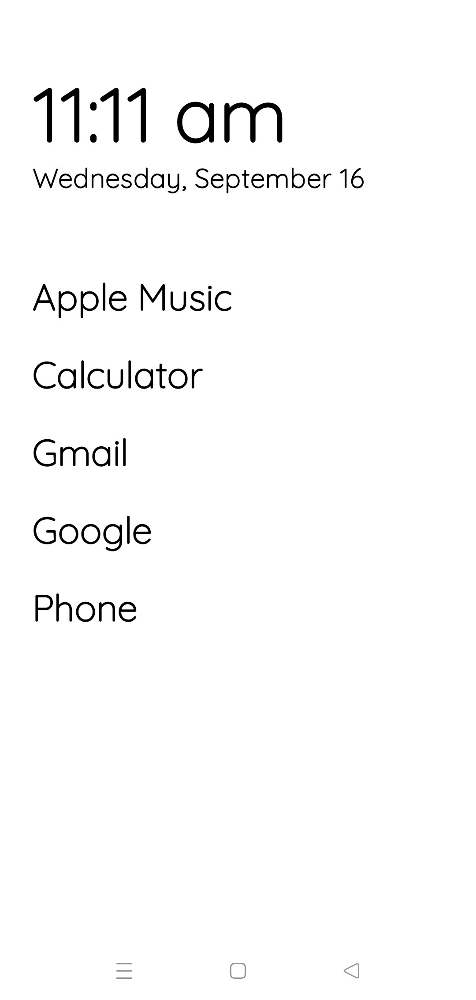
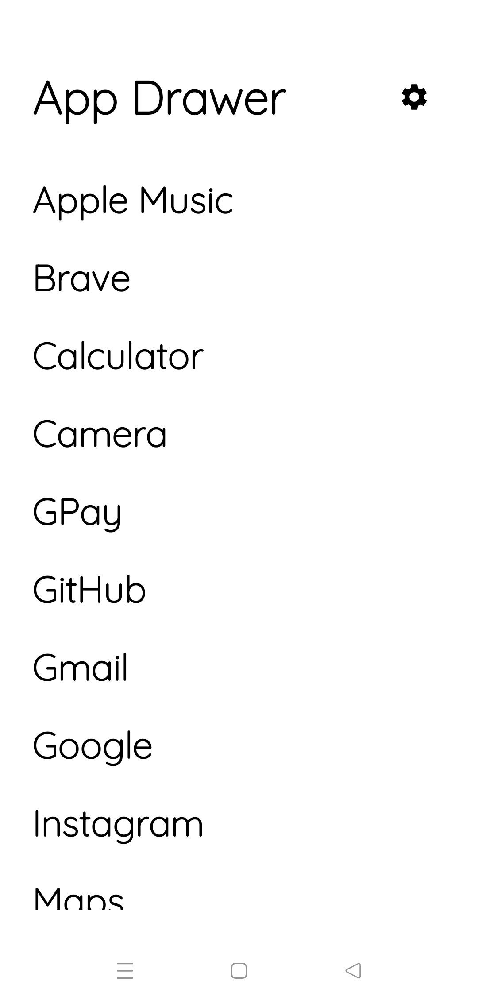
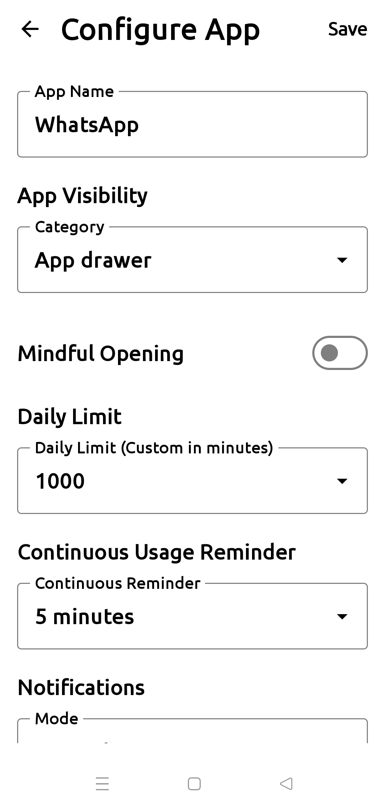
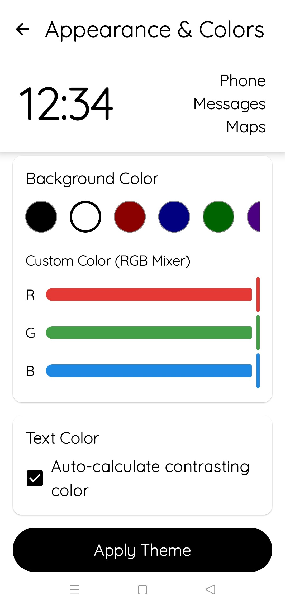
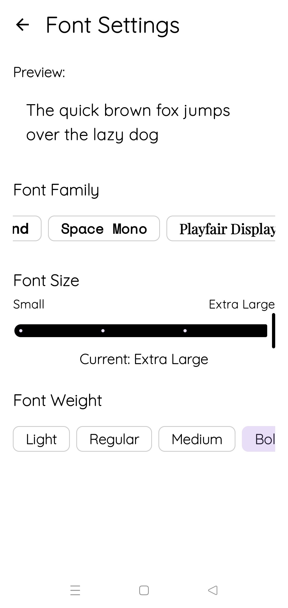
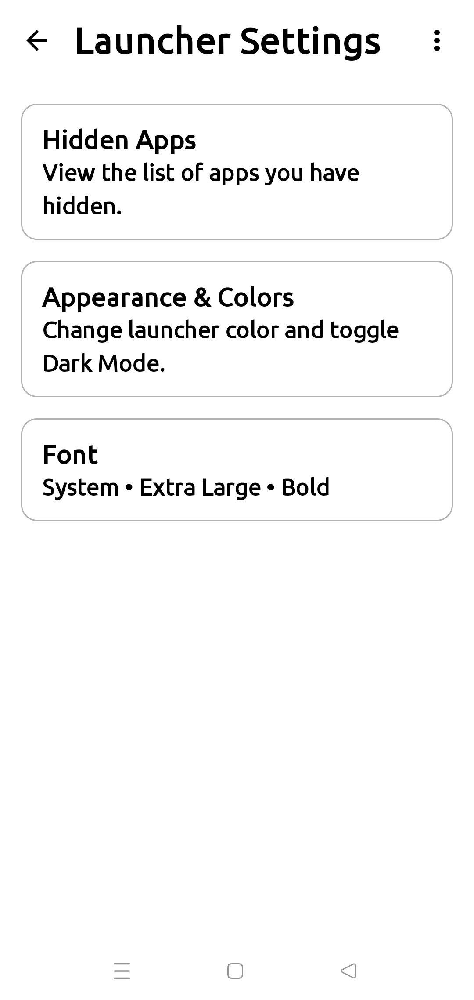

# DumbPhoneLauncher

I was addicted to my phone and my screen time was incredibly high. I built this to get my time back.

DumbPhoneLauncher is a distraction-free, text-based Android launcher engineered to mitigate digital distraction. By abstracting away traditional icon grids, notification badges, and complex app drawers, the launcher provides an intentional, friction-based interface that promotes mindful device usage.

## Installation / Download APK

1. Go to the [GitHub Releases](https://github.com/CodeMasterAbhishek/Dumb-phone-launcher/releases/latest) page.
2. Download the latest `.apk` file (e.g. `app-release.apk`) to your phone.
3. Open the downloaded file to install it. *(Note: You may need to grant your browser permission to "Install unknown apps").*
4. Press your phone's Home button and set **DumbPhoneLauncher** as your default Home app.

## Interface & Features

<table>
  <tr>
    <td align="center">
      <b>Home Screen</b> 
       
      
    </td>
    <td align="center">
      <b>App Drawer</b> 
       
      
    </td>
    <td align="center">
      <b>App Configuration</b> 
       
      
    </td>
  </tr>
  <tr>
    <td align="center">
      <b>Advanced Theming</b> 
       
      
    </td>
    <td align="center">
      <b>Custom Typography</b> 
       
      
    </td>
    <td align="center">
      <b>Launcher Settings</b> 
       
      
    </td>
  </tr>
</table>

### Core Capabilities

* **Clean Home Screen:** The primary interface is restricted to essential information. It features a high-contrast time and date display alongside a text-based list of user-defined essential applications, eliminating visual stimuli.
* **Intentional App Drawer:** Access to non-essential applications is deliberately decoupled from the main interface. The secondary app drawer is accessible via gesture and displays approved applications in a standardized typographic format.
* **App Configuration:** Individually configure each application. Set custom names, daily time limits, mindful opening delays, and continuous usage reminders.
* **Application Access Tiers:** Applications are categorized into strict operational tiers:
  * **Quick Access:** Pinned directly to the primary home screen.
  * **App Drawer:** Accessible through the secondary menu interface.
  * **Utility / Background:** Hidden from all user interfaces and blocked from manual foreground execution. Background services and system overlays (e.g., caller ID, password autofill) are preserved and permitted to operate.
  * **Strictly Blocked:** Terminated upon foreground initialization with no system access allowances.
* **Advanced Theming Engine:** Supports comprehensive color customization. Users can define custom RGB values for background and text components, or utilize the built-in auto-contrast calculation engine to guarantee optimal legibility.
* **Custom Typography:** Integrates high-legibility typefaces (including Lexend, Space Mono, Playfair Display, and Atkinson Hyperlegible). Parameters such as scaling and weight are globally adjustable.
* **Launcher Settings:** Manage your hidden apps, tweak your appearance, and adjust typography directly from the minimalist settings interface.

## Technical Implementations

* **Friction Protocols (Mindful Delays):** Selected applications require an enforced, non-bypassable countdown sequence prior to initialization.
* **System Event Bypasses:** The blocking engine actively monitors `TelephonyManager` states and system alarm broadcasts to dynamically suspend constraints during critical events (e.g., incoming calls, active alarms).
* **Temporary Access Grants:** Strict blocks feature a regulated 15-second access window for utility tasks (e.g., retrieving two-factor authentication tokens).
* **Display Optimization:** The application automatically requests the maximum supported display refresh rate (e.g., 90Hz/120Hz/144Hz) via the `WindowManager` API to ensure fluid UI rendering.
